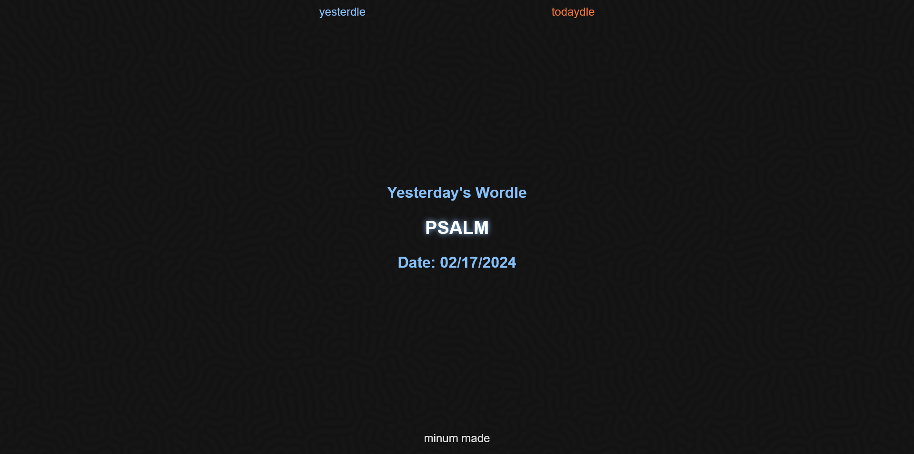

# Yesterdle

### The Problem

I wanted a reliable, ad free, and concise place to see the previous days [Wordle](https://www.nytimes.com/games/wordle/index.html) answer. So I decided to create a site that does just that.

If it is still up it can be found at https://yesterdle.carroll.codes/ if not or you just want to host this yourself you can find the helm chart at charts/yesterdle/

The bread and butter is a cronjob which runs at 00:30 UTC (by default) which spins up 2 containers; one running a selenium standalone server, and another which scrapes the Wordle website.

**This project was made using [Minum](https://github.com/byronka/minum). A minimalist Java web framework designed by byronka.**